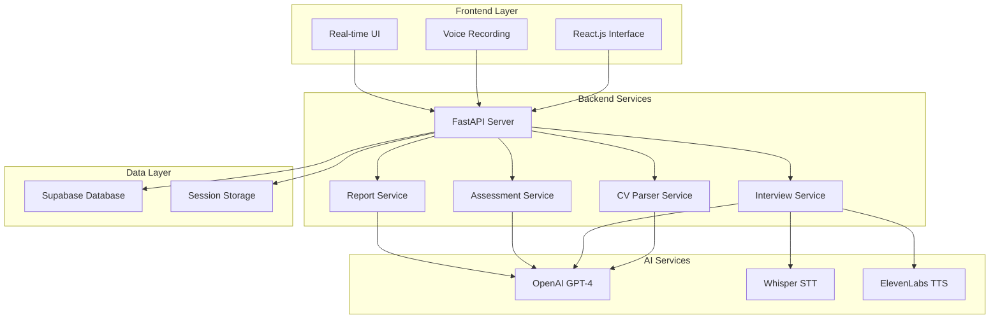

# 🤖 AI Recruiter Co-Pilot

## 🌟 Overview

AI Recruiter Co-Pilot is a comprehensive recruitment automation platform that transforms traditional hiring processes through artificial intelligence. Our system provides end-to-end candidate screening, from CV analysis to voice-led interviews and skills assessments, all powered by cutting-edge AI technology.

## ✨ Features

### 🧠 **AI-Powered Core**
- **🔍 Intelligent CV Analysis** - GPT-4 powered CV parsing and skill extraction
- **🎤 Voice-Led Interviews** - Natural conversation with speech-to-text/text-to-speech
- **📝 Dynamic Questioning** - AI-generated questions tailored to candidate background
- **🏆 MERIT Evaluation** - Comprehensive 5-dimension scoring system

### 💼 **Complete Recruitment Pipeline**
- **📄 Document Processing** - Support for PDF, DOC, DOCX, TXT formats
- **🗣️ Voice Technology** - Whisper API + ElevenLabs integration
- **💻 Skills Assessment** - Role-specific coding challenges and business cases
- **📊 Detailed Reports** - Professional evaluation reports with recommendations

### 🛠️ **Technical Excellence**
- **⚡ Real-time Processing** - Instant feedback and seamless user experience
- **🔒 Secure & Scalable** - Enterprise-grade security with Supabase backend
- **📱 Responsive Design** - Works perfectly on desktop, tablet, and mobile
- **🌐 RESTful API** - Complete API for integrations and custom implementations

---

## 🏗️ Architecture



---

## 🛠️ Tech Stack

<div align="center">

### Backend


### Frontend


### Database & Storage


</div>

---

## ⚡ Quick Start

### 📋 Prerequisites

- **Python 3.8+** 🐍
- **Node.js 16+** 📦
- **API Keys**: OpenAI, ElevenLabs, Supabase 🔑

### 🚀 Installation

#### Option 1: Automated Setup (Recommended)

```bash
# Clone the repository
git clone https://github.com/yourusername/ai-recruiter-copilot.git
cd ai-recruiter-copilot

# Run automated setup
python setup.py
```

#### Option 2: Manual Setup

```bash
# 1. Clone and navigate
git clone https://github.com/yourusername/ai-recruiter-copilot.git
cd ai-recruiter-copilot

# 2. Backend setup
cd backend
python -m venv venv
source venv/bin/activate  # On Windows: venv\Scripts\activate
pip install -r requirements.txt

# 3. Frontend setup
cd ../frontend
npm install

# 4. Environment configuration
cp .env.example .env
# Edit .env with your API keys
```

### 🔧 Configuration

Create `.env` file in the root directory:

```bash
# API Keys
OPENAI_API_KEY=your_openai_api_key_here
ELEVENLABS_API_KEY=your_elevenlabs_api_key_here

# Supabase Configuration
SUPABASE_URL=your_supabase_project_url
SUPABASE_KEY=your_supabase_anon_key

# Optional Settings
ELEVENLABS_VOICE_ID=21m00Tcm4TlvDq8ikWAM
REACT_APP_API_URL=http://localhost:8000
```

### 🏃‍♂️ Running the Application

#### Backend Server
```bash
cd backend
source venv/bin/activate  # On Windows: venv\Scripts\activate
python app.py
```
🌐 Backend runs on `http://localhost:8000`

#### Frontend Application
```bash
cd frontend
npm start
```
🌐 Frontend runs on `http://localhost:3000`

---

## 📖 Usage Guide

### 👤 For Candidates

1. **📤 Upload CV**: Drag & drop your resume (PDF, DOC, DOCX, TXT)
2. **🎤 Voice Interview**: Answer AI-generated questions via voice or text
3. **💻 Skills Assessment**: Complete role-specific challenges
4. **📊 View Results**: Access your comprehensive evaluation report

### 👥 For Recruiters

1. **📈 Monitor Progress**: Track candidate sessions in real-time
2. **📋 Review Evaluations**: Access detailed MERIT-based assessments
3. **📊 Generate Reports**: Export candidate data for decision making
4. **⚙️ Customize Settings**: Adjust evaluation criteria and question banks

---

## 🎯 MERIT Evaluation Framework

Our proprietary MERIT system evaluates candidates across 5 critical dimensions:

<div align="center">

| Dimension | Weight | Description |
|-----------|---------|-------------|
| **🗣️ Communication** | 20% | English proficiency, clarity, articulation |
| **🔧 Technical Knowledge** | 25% | Role-specific expertise and depth |
| **🧩 Problem Solving** | 25% | Analytical thinking and structured approach |
| **👔 Professionalism** | 15% | Digital presence and presentation |
| **🎯 Cultural Fit** | 15% | Values alignment and work ethic |

</div>

### 📊 Scoring Scale

- **5 - Exceptional**: Top 10% performers, immediate hire
- **4 - Strong**: Above average, recommended for hire
- **3 - Good**: Meets requirements, consider for role
- **2 - Below Average**: Needs development, potential with training
- **1 - Poor**: Does not meet role requirements

---

## 📋 API Documentation

### 🔗 Base URL
```
http://localhost:8000
```

### 📡 Core Endpoints

<details>
<summary><b>Session Management</b></summary>

```http
POST /session/start
GET /session/{id}/status
POST /session/{id}/complete-interview
```
</details>

<details>
<summary><b>CV Processing</b></summary>

```http
POST /session/{id}/upload-cv
Content-Type: multipart/form-data

{
  "file": "cv.pdf"
}
```
</details>

<details>
<summary><b>Interview Flow</b></summary>

```http
GET /session/{id}/question
POST /session/{id}/answer
POST /session/{id}/speech-to-text
GET /session/{id}/text-to-speech?text={text}
```
</details>

<details>
<summary><b>Assessment & Reporting</b></summary>

```http
POST /session/{id}/start-assessment
POST /session/{id}/submit-assessment
GET /session/{id}/report
```
</details>

### 📚 Full API Documentation
Visit `http://localhost:8000/docs` for interactive Swagger documentation.

---

## 🚀 Deployment

### 🌐 Production Deployment

#### Backend (Railway/Heroku)
```bash
# Install dependencies
pip install -r requirements.txt

# Create Procfile
echo "web: uvicorn app:app --host 0.0.0.0 --port \$PORT" > Procfile

# Deploy to your platform
```

#### Frontend (Vercel/Netlify)
```bash
# Build production version
npm run build

# Deploy dist folder to your platform
```

#### Environment Variables
Set these in your deployment platform:
- `OPENAI_API_KEY`
- `ELEVENLABS_API_KEY`
- `SUPABASE_URL`
- `SUPABASE_KEY`

---

## 🧪 Testing

### 🔧 Run Tests
```bash
# Backend tests
cd backend
python -m pytest tests/

# Frontend tests
cd frontend
npm test

# API integration tests
python test_api.py
```

### 📊 Test Coverage
```bash
# Generate coverage report
cd backend
pytest --cov=. --cov-report=html
```

---

## 🤝 Contributing

We welcome contributions! Please see our [Contributing Guidelines](CONTRIBUTING.md) for details.

### 🛠️ Development Setup

1. **Fork** the repository
2. **Clone** your fork
3. **Create** a feature branch (`git checkout -b feature/amazing-feature`)
4. **Commit** your changes (`git commit -m 'Add amazing feature'`)
5. **Push** to the branch (`git push origin feature/amazing-feature`)
6. **Open** a Pull Request

### 📝 Code Style
- **Python**: Follow PEP 8, use `black` formatter
- **JavaScript**: Follow Airbnb style guide, use `prettier`
- **Commits**: Use conventional commits format

---


**Built with ❤️**

[⬆ Back to Top](#-ai-recruiter-co-pilot)

</div>
